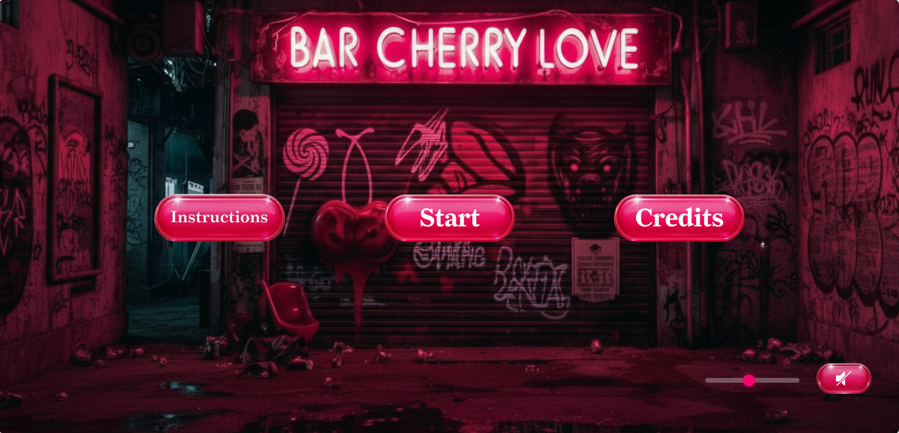
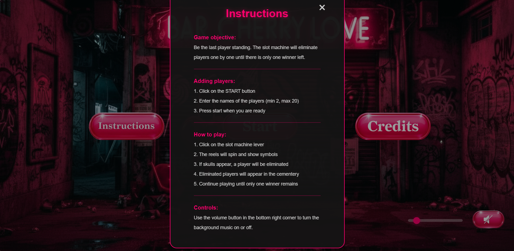
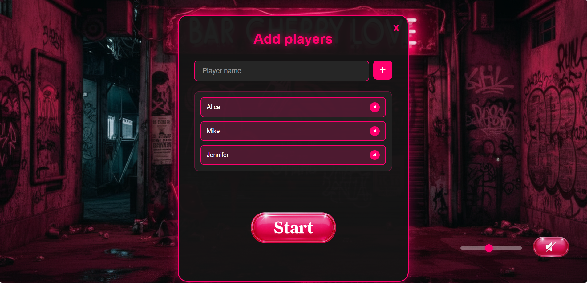
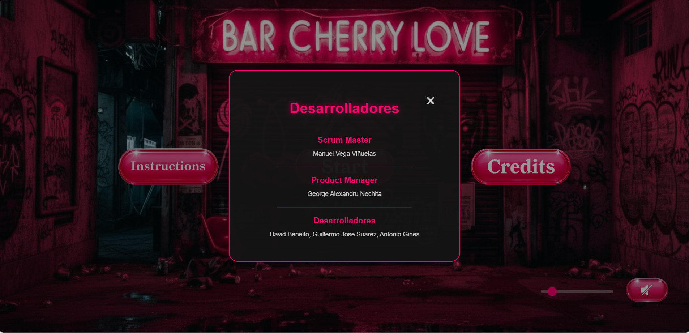
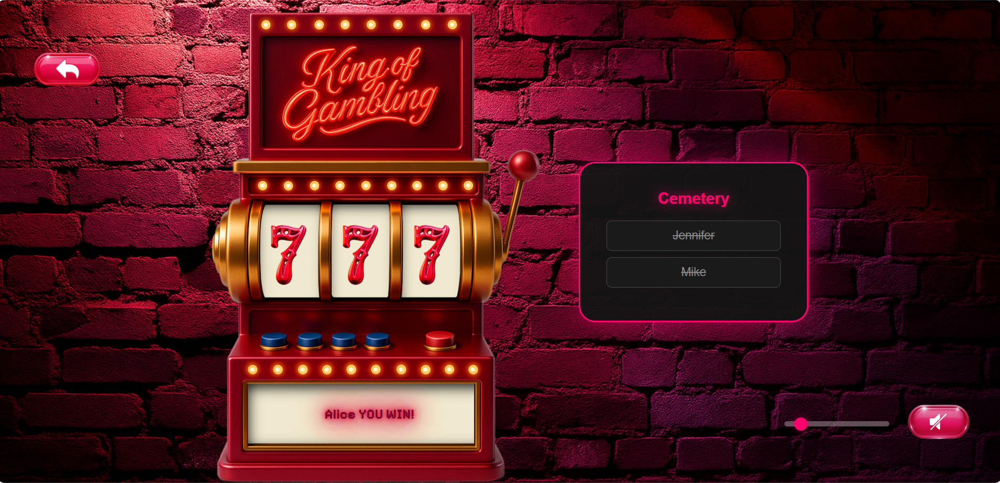

# Kings of Gambling

A fun web-based slot machine game where players compete to be the last one standing. Built with vanilla JavaScript, HTML, and CSS.

## About The Project

Kings of Gambling is an interactive elimination game where players take turns spinning a slot machine. Each spin randomly eliminates one player until only one winner remains. The game features exciting animations, sound effects, and a celebration video for the winner.

## Features

- Easy to play slot machine game
- Multiple player support (minimum 2 players)
- Background music and sound effects
- Volume control with slider
- Responsive design for mobile and desktop
- Winner celebration with video
- Cemetery list for eliminated players
- Neon pink theme with dark background

## Technologies Used

- HTML5
- CSS3
- JavaScript (ES6+)
- SweetAlert2 for popups
- Jest for testing
- LocalStorage for data persistence

## Project Structure

```
Kings-of-gambling/
├── Game/           # Main game files
├── Init/           # Initial menu and lobby
├── Players/        # Player management screen
├── test/           # Test files
├── index.html      # Entry point
└── package.json    # Dependencies
```

## Getting Started

### Installation

1. Clone the repository
```bash
git clone https://github.com/Vega8991/Kings-of-gambling.git
```

2. Navigate to the project folder
```bash
cd Kings-of-gambling
```

3. Install dependencies
```bash
npm install
```

4. Open `index.html` in your browser or use a local server

### Running Tests

```bash
npm test
```

## How To Play

1. **Start**: Click the "Start" button on the main menu
2. **Add Players**: Enter at least 2 player names
3. **Spin**: Pull the lever or click the spin button
4. **Elimination**: Players are randomly eliminated each round
5. **Winner**: The last remaining player wins the game!

## Game Screens

### Main Lobby
The main menu where you can start the game, read instructions, or view credits.



### Instructions
Learn how to play the game with clear and simple steps.



### Player Management
Add players to start the game. You need at least 2 players to begin.



### Credits
Meet the team behind Kings of Gambling.



### Game Screen
The slot machine with spinning reels and the cemetery list showing eliminated players.


### Winner Celebration
When a player wins, they see a celebration video and popup with options.




## Team

- **Scrum Master**: Manuel Vega Viñuelas
- **Product Manager**: George Alexandru Nechita
- **Developers**: David Beneito, Guillermo José Suárez, Antonio Ginés

## License

This project was created for educational purposes.

## Live Demo

Visit the live version: [Kings of Gambling](kings-of-gambling.vercel.app)

## Contact

Project Link: [https://github.com/Vega8991/Kings-of-gambling](https://github.com/Vega8991/Kings-of-gambling)

---

Made with love by the Kings of Gambling team